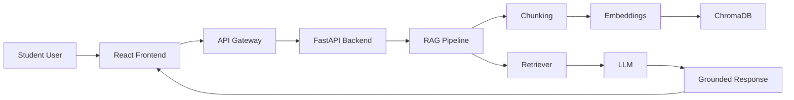
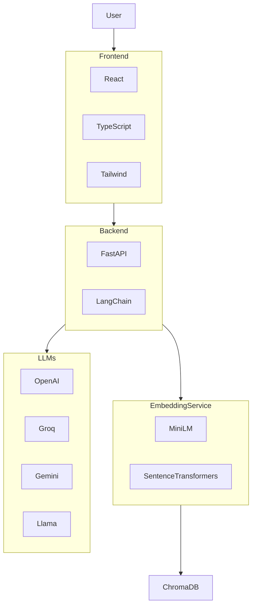
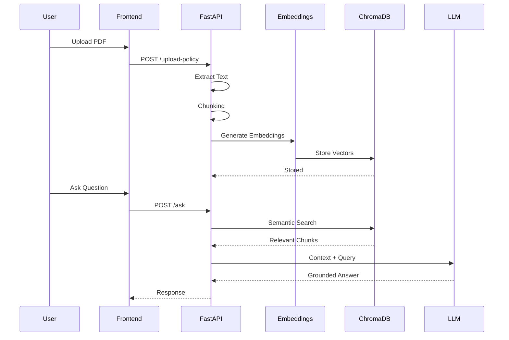
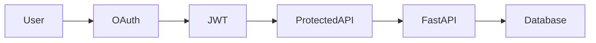
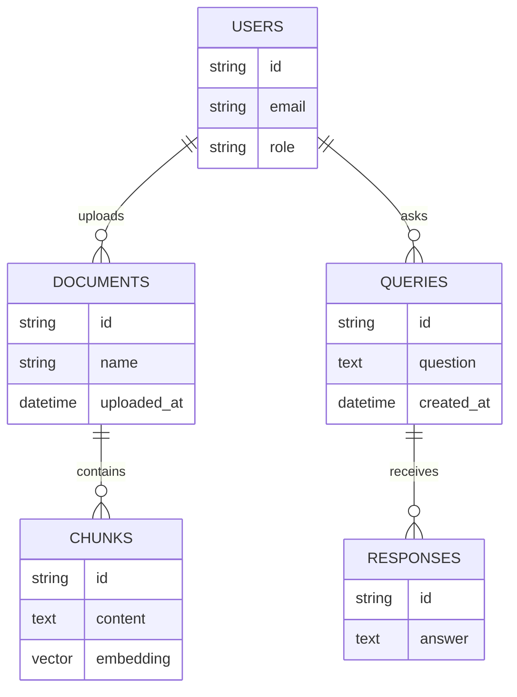
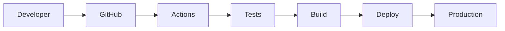
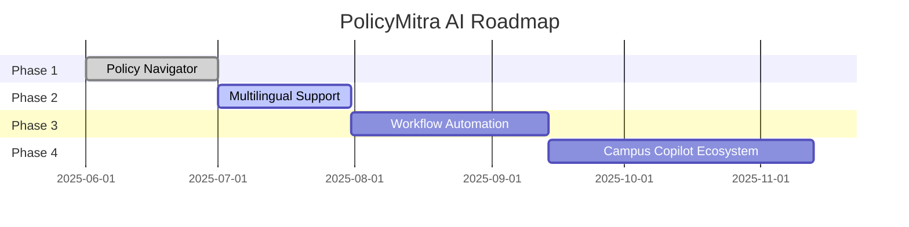

# 🚀 PolicyMitra AI

<div align="center">


<br/>

# 🧠 PolicyMitra AI

### *Your AI Senior for Understanding College Policies*

<p align="center">
An AI-powered RAG platform that transforms complex institutional regulations into understandable, trustworthy, and actionable guidance.
</p>

<br/>


<br/><br/>

<a href="#-live-demo">
  
</a>

<a href="#-system-architecture">
  
</a>

<a href="#-api-reference">
  
</a>

<a href="#-deployment">
  
</a>

</div>

---

<div align="center">

## ✨ Transforming Policy Confusion into Student Clarity

</div>

Students often struggle with:

* Attendance regulations
* Hostel rules
* Examination policies
* Scholarship eligibility
* Academic grievances
* Administrative procedures
* Disciplinary guidelines

PolicyMitra AI acts as an intelligent policy navigator that allows students to upload official policy documents and ask questions in natural language.

Instead of searching through hundreds of pages, students receive:

✅ Accurate Answers

✅ Relevant Sources

✅ Student-Friendly Explanations

✅ Actionable Guidance

✅ Structured Complaint Drafts

---

# 🏆 Hackathon Alignment

Built specifically around the **AI for Campus Operations** and **AI for Indian Multilingual Users** challenge themes, combining:

* AI Campus Policy Navigator
* AI Grievance Assistant
* Hinglish Policy Explainer
* Multi-step RAG Workflow
* Actionable Student Outputs

This directly addresses the hackathon's campus policy navigation and multilingual policy explanation challenges.

---

# 🛡️ Badges

<div align="center">


</div>

---

# 🌟 Core Features

<div align="center">

| Feature                  | Description                                   |
| ------------------------ | --------------------------------------------- |
| 🧭 AI Policy Navigator   | Ask questions directly from uploaded policies |
| 📄 Policy Summarization  | Generate concise summaries                    |
| 🧒 ELI5 Mode             | Explain regulations in simple language        |
| 📋 Action Plan Generator | Convert policies into actionable steps        |
| ⚖️ Grievance Assistant   | Draft structured complaints                   |
| 🔎 Semantic Search       | Vector-powered retrieval                      |
| 📚 Source Grounding      | Every answer backed by policy text            |
| 🌐 Multilingual Support  | English + Hinglish understanding              |
| 🔐 Secure Isolation      | Document-specific retrieval                   |
| ⚡ Fast Responses         | Optimized RAG pipeline                        |

</div>

---

# 🎬 Product Walkthrough

---

## 📂 Policy Upload

<div align="center">


</div>

---

## 💬 Policy Question Answering

<div align="center">


</div>

---

## 🧒 ELI5 Mode

<div align="center">


</div>

---

## 📋 Action Plan Generator

<div align="center">


</div>

---

## ⚖️ Grievance Generator

<div align="center">


</div>

---

## 📊 Admin Dashboard

<div align="center">


</div>

---

# 🏗️ System Architecture

## High-Level Architecture



---

## C4 Container Diagram



---

## Sequence Diagram



---

## Authentication Flow



---

## ER Diagram



---

## Deployment Diagram

```mermaid
flowchart LR

Browser

--> Vercel

Vercel

--> Railway

Railway

--> FastAPI

FastAPI

--> ChromaDB

FastAPI

--> LLM Providers
```

---

## CI/CD Pipeline



---

# 🧠 RAG Pipeline

```mermaid
flowchart TB

PDF

--> Text Extraction

Text Extraction

--> Chunking

Chunking

--> Embedding Generation

Embedding Generation

--> ChromaDB

Question

--> Retriever

Retriever

--> Relevant Chunks

Relevant Chunks

--> LLM

LLM

--> Grounded Answer

Grounded Answer

--> Student
```

---

# 📁 Folder Structure

```text
PolicyMitraAI/
│
├── frontend/
│   ├── src/
│   ├── components/
│   ├── pages/
│   ├── hooks/
│   └── assets/
│
├── backend/
│   ├── app/
│   │   ├── api/
│   │   ├── services/
│   │   ├── rag/
│   │   ├── models/
│   │   └── core/
│   │
│   ├── tests/
│   └── requirements.txt
│
├── docs/
├── architecture/
├── docker/
├── .github/
│   └── workflows/
│
├── screenshots/
├── README.md
└── docker-compose.yml
```

---

# ⚙️ Tech Stack

## Frontend

| Technology    | Purpose      |
| ------------- | ------------ |
| React         | UI Framework |
| TypeScript    | Type Safety  |
| Tailwind CSS  | Styling      |
| Framer Motion | Animations   |
| ShadCN UI     | Components   |

---

## Backend

| Technology | Purpose       |
| ---------- | ------------- |
| FastAPI    | API Framework |
| Python     | Core Language |

---

## AI Layer

| Technology   | Purpose         |
| ------------ | --------------- |
| LangChain    | Orchestration   |
| ChromaDB     | Vector Storage  |
| HuggingFace  | Embeddings      |
| MiniLM-L6-v2 | Semantic Search |

---

## LLM Providers

| Provider | Usage                |
| -------- | -------------------- |
| OpenAI   | GPT Models           |
| Groq     | Fast Inference       |
| Gemini   | Multimodal Reasoning |
| Llama    | Open Source LLM      |

---

# 📡 API Reference

## Upload Policy

| Method | Endpoint         |
| ------ | ---------------- |
| POST   | `/upload-policy` |

### Request

```json
{
  "file": "policy.pdf"
}
```

---

## Ask Question

| Method | Endpoint |
| ------ | -------- |
| POST   | `/ask`   |

```json
{
  "question":"What is attendance requirement?"
}
```

---

## Generate Complaint

| Method | Endpoint              |
| ------ | --------------------- |
| POST   | `/generate-complaint` |

---

## Explain Simple

| Method | Endpoint          |
| ------ | ----------------- |
| POST   | `/explain-simple` |

---

## Health Check

| Method | Endpoint  |
| ------ | --------- |
| GET    | `/health` |

---

## Debug Chunks

| Method | Endpoint        |
| ------ | --------------- |
| GET    | `/debug/chunks` |

---

# 🔒 Security

<details>

<summary><b>Security Controls</b></summary>

### JWT Authentication

* Secure API access
* Token expiration
* Role-based authorization

### Document Isolation

* User-specific document access
* Namespace segregation

### Prompt Injection Protection

* Input sanitization
* Context filtering
* Source validation

### RAG Guardrails

* Grounded-only responses
* Hallucination reduction
* Citation enforcement

</details>

---

# ⚡ Performance Metrics

| Metric               | Performance |
| -------------------- | ----------- |
| PDF Upload           | < 3 sec     |
| Chunking             | < 1 sec     |
| Embedding Generation | < 2 sec     |
| Vector Search        | < 150 ms    |
| Retrieval Pipeline   | < 300 ms    |
| Response Generation  | < 3 sec     |
| End-to-End Query     | < 4 sec     |

---

# 🗺️ Product Roadmap



---

# 🚀 Local Setup

```bash
git clone https://github.com/your-org/policymitra-ai.git

cd policymitra-ai
```

---

### Frontend

```bash
cd frontend

npm install

npm run dev
```

---

### Backend

```bash
cd backend

pip install -r requirements.txt

uvicorn app.main:app --reload
```

---

### Docker

```bash
docker-compose up --build
```

---

# 🤝 Contributing

We welcome contributions from the community.

### Workflow

1. Fork repository
2. Create feature branch
3. Commit changes
4. Push branch
5. Open Pull Request

### Guidelines

* Follow clean architecture
* Write tests
* Maintain documentation
* Use meaningful commit messages
* Keep PRs focused and reviewable

---

# 📊 Why PolicyMitra AI?

| Traditional Policy PDFs | PolicyMitra AI                |
| ----------------------- | ----------------------------- |
| Hundreds of pages       | Instant answers               |
| Difficult language      | Student-friendly explanations |
| Manual searching        | Semantic retrieval            |
| No guidance             | Actionable next steps         |
| No multilingual support | Hinglish understanding        |
| No context              | Source-grounded responses     |

---

# 📜 License

Licensed under the MIT License.

```text
MIT License

Copyright (c) 2026 PolicyMitra AI

Permission is hereby granted, free of charge,
to any person obtaining a copy of this software...
```

---

<div align="center">

# 🌟 PolicyMitra AI

### Your AI Senior for Understanding College Policies

<br/>

Built for **AI for Impact Hackathon**

<br/>

⚡ FastAPI
⚡ React
⚡ LangChain
⚡ ChromaDB
⚡ Generative AI

<br/>


<br/><br/>

[🌐 Website](#) •
[📚 Docs](#) •
[🎥 Demo](#) •
[💬 Discord](#) •
[🐦 Twitter](#)

<br/>

### ⭐ If this project helps students, consider starring the repository.

</div>
